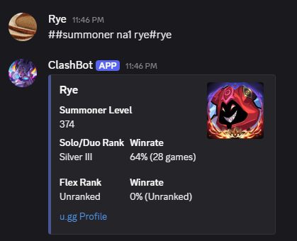
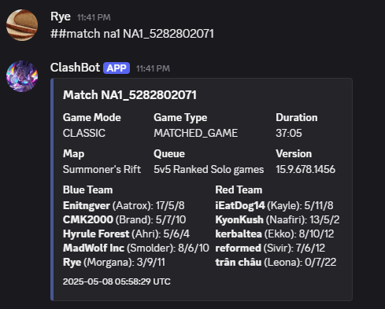

# ClashBot

## Overview
ClashBot is a Discord bot designed to enhance the League of Legends Clash tournament experience by providing opponent research capabilities. The bot helps teams gather and analyze information about their opponents, giving them a strategic advantage in their Clash matches.

## Features
- Opponent research for League of Legends Clash tournaments
- Discord integration for easy team communication
- Automated data retrieval from Riot Games API
- User-friendly command interface with `##` prefix

### Example Embeds
The bot provides detailed information through Discord embeds:

\
*Detailed summoner information and statistics*

\
*Comprehensive match history and performance data*

## Prerequisites
- Python 3.8 or higher
- Discord account and bot token
- Riot Games API key
- Discord server with appropriate permissions

## Installation

1. Clone the repository:
```bash
git clone https://github.com/yourusername/ClashBot.git
cd ClashBot
```

2. Create a virtual environment (recommended):
```bash
python -m venv venv
source venv/bin/activate  # On Windows: venv\Scripts\activate
```

3. Install dependencies:
```bash
pip install -r requirements.txt
```

4. Create a `.env` file in the root directory with your credentials:
```
BOT_KEY=your_discord_bot_token
RIOT_API_KEY=your_riot_api_key
```

## Usage

1. Start the bot:
```bash
python main.py
```

2. Once the bot is running, you can use it in your Discord server with the `##` command prefix.
